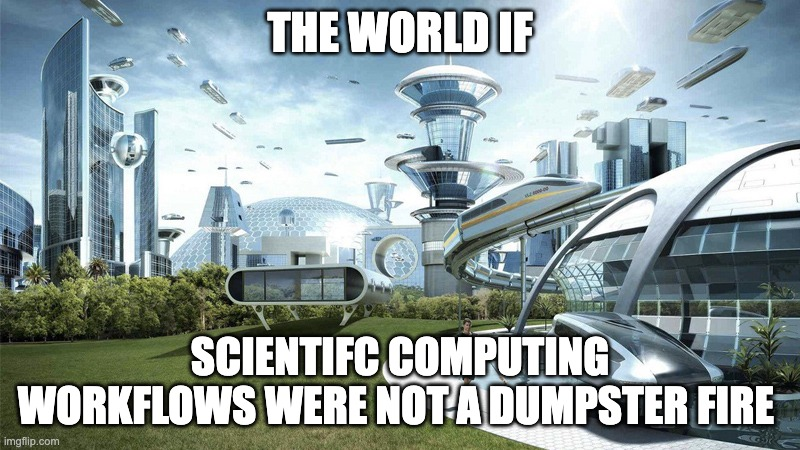
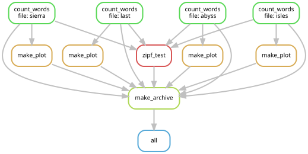

------------------------------------------------------------------------

# My Scientific Albatross {.bg-dark-texture auto-animate="true"}

## The Summer School Trap

::::::: columns
:::: {.column width="60%"}
::: {.glass-card .fragment .fade-up}
### The Project

-   **Goal**: Fit opinion spreading models to network data.
-   **Start**: First year of grad school workshop.
-   **Initial Code**: Quick & dirty PyTorch.
:::
::::

:::: {.column width="40%"}
::: {.glass-card .fragment .fade-left}
### The Vibe

"It'll be 6 months, tops, to a publication." 🤡
:::
::::
:::::::

## The Descent: Feature Creep {auto-animate="true"}

::::::: columns
:::: {.column width="50%"}
::: {.glass-card .fragment .fade-up}
### Phase 1: Portability

-   **Problem**: 5 collaborators on every OS.
-   **"Solution"**: JSON configs + nested Shell wrappers.
:::
::::

:::: {.column width="50%"}
::: {.glass-card .fragment .fade-up}
### Phase 2: HPC (VACC)

-   **Problem**: Local vs. Cluster batch jobs.
-   **"Solution"**: Custom J2 templating system.
:::
::::
:::::::

## The Final Collapse {auto-animate="true"}

::::::: columns
:::: {.column width="50%"}
::: {.glass-card .fragment .fade-right}
### Over-Engineering

-   SQLite locking? **Move to MySQL.**
-   UVM Firewall? **Polymorphic IO.**
-   Filename limits? **Build an ORM.**
:::
::::

:::: {.column width="50%"}
::: {.glass-card .fragment .fade-left}
### The End

-   2026: No publication.
-   Framework is too convoluted to use.
-   Collaborators keep force-pushing to `main` because they hate the code.
:::
::::
:::::::

# The Hard Truth {.bg-dark-texture}

::: r-fit-text
"This was all my fault."
:::


## A Moral Failure

{fig-align="center" height="500px"}


# Without SLURM We Would Have Cured Cancer By Now {.bg-dark-texture}

## The Iron Rule of Scientific Software Development

::: {.glass-card .fragment .fade-up}
-   If you take the time to build out code the right way you will never use it
:::

::: {.glass-card .fragment .fade-up}
-   If you write sloppy code it will bite you in the ass
:::

::: {.glass-card .fragment .fade-up}
-   **Damned if you do. Damned if you don't.**
:::

## The Python Paradox {auto-animate="true"}

:::::::: columns
::::: {.column width="60%"}
::: {.glass-card .fragment .fade-up}
-   Python is a **TERRIBLE** language for scientific computing.
-   Nothing about the language is inherently good for science.
-   Most tools were developed by researchers as a "side-hustle."
:::

::: {.glass-card .fragment .fade-in-then-semi-out}
-   **The Goal**: How can we contort Python to be at least "okay"?
:::
:::::

:::: {.column width="40%"}
::: {.fragment .fade-right}
{fig-align="center" width="100%"}
:::
::::
::::::::

# The Dirty Secret... {.bg-accent-2}

::: incremental
-   If you are a (non-bench) scientist in 2026: **YOU ARE A SOFTWARE DEVELOPER.**
-   Most of your time isn't in the lab; it's writing and running code.
-   **Fact**: Scientists are (mostly) bad software developers.
:::

## Logic of my Life

The eternal struggle: Time spent to automate vs. overhead accumulated.

{fig-align="center" height="450px"}

# The Good News {.bg-accent-1}

::: incremental
-   **Fact**: LLMs change the ROI on automation.
-   **Fact**: Being an effective vibe coder means **BEING AN EFFECTIVE CODER**.
:::

## Your Workflow {.bg-accent-3}

::::::: columns
:::: {.column width="60%"}
::: {.glass-card .fragment}
### The Process
-   You have data & simulation parameters.
-   You have a model (statistical/ML/physics).
-   You want to run sweeps with fixed logic.
-   You want to collect & visualize results.
-   You want to turn plots into a **publication**.
:::
::::

:::: {.column width="40%"}
::: {.glass-card .fragment}
### The Goal
**Automate the plumbing** so you can focus on the **science**.
:::
::::
:::::::


# Example Project

- Train a BERT to correctly classifer thhe AG news dataset
  - 4 classes: Buisness, Sci/Tech, Sports/World
- Train an MLP classifier on BERT embeddings

# The Tools {.bg-primary}

## 1. Modularity

- ****


## 1. The Environment {auto-animate="true"}

::::::: columns
:::: {.column width="50%"}
::: {.glass-card .fragment}
### Reproducible UV

-   **Speed**: Orders of magnitude faster than pip/conda.
-   **Locking**: `uv.lock` ensures your code runs *everywhere*.
:::
::::

:::: {.column width="50%"}
::: {.glass-card .fragment}
### Modular Source

-   **No More Notebooks**: Logic lives in `.py` modules.
-   **Git Flow**: Use Pull Requests to manage complexity.
:::
::::
:::::::

::: footer
Docs: [astral.sh/uv](https://docs.astral.sh/uv/) \| [git-scm.com](https://git-scm.com)https://github.com/WillHWThompson/PythonForScientificDevelopment
:::

## 2. The Workflow {auto-animate="true"}

::::::: columns
:::: {.column width="50%"}
::: {.glass-card .fragment}
### Workflow Management
-   **Automation**: Snakemake tracks results and dependencies.
-   **VACC Scaling**: Integrated Slurm profiles for zero-effort submission.
-   **Amnesia Proof**: Automatically identifies stale results.
-   **Local vs Cloud**: Run 1 locally; run 1,000 on the cluster.
:::
::::

:::: {.column width="50%"}
::: {.glass-card .fragment}
### Workflow DAG
{fig-align="center" width="100%"}
:::
::::
:::::::

::: footer
Docs: [snakemake.github.io](https://snakemake.github.io/) \| [vacc.uvm.edu](https://www.uvm.edu/vacc/docs/)
:::

## 3. The Data Lifecycle {auto-animate="true"}

::::::: columns
:::: {.column width="50%"}
::: {.glass-card .fragment}
### Validated Data
-   **Pydantic**: Catch errors at the boundary.
-   **LLM Context**: Structured slots for model reasoning.
:::
::::

:::: {.column width="50%"}
::: {.glass-card .fragment}
### High-Perf Analytics
-   **Parquet + DuckDB**: SQL speed on flat files.
-   **Testing**: Shape checks to verify the "vibe."
:::
::::
:::::::

::: footer
Docs: [duckdb.org](https://duckdb.org/) \| [pydantic.dev](https://docs.pydantic.dev/)
:::

## 4. Unit Testing {auto-animate="true"}

::::::: columns
:::: {.column width="50%"}
::: {.glass-card .fragment}
### Pytest Rigor
-   **Logic Checks**: Validate each part of your research code.
-   **Integration**: Ensure the whole system plays together nicely.
:::
::::

:::: {.column width="50%"}
::: {.glass-card .fragment}
### GitHub Actions
-   **Automation**: Run tests on every push.
-   **Trust**: Know your "vibe" is actually correct.
:::
::::
:::::::

::: footer
Docs: [pytest.org](https://docs.pytest.org/) \| [github.com/features/actions](https://github.com/features/actions)
:::


# Live Diagnostics {.bg-accent-1}

## Research Dashboard

::: glass-card
We don't just generate plots; we generate **interactive insights**.
:::

::: {.fragment .fade-up}
```{ojs}
//| echo: false
import { view } from "@observablehq/inputs"

// Placeholder for interactive OJS component demonstration
md`### 📊 [View Integrated Dashboard](dashboard.qmd)`
```
:::

# Summary {.bg-primary}

::: {.glass-card .fragment .fade-up}
1.  **Accept that you are a Developer.** We are all software engineers now.
:::

::: {.glass-card .fragment .fade-up}
2.  **Standardize Environments.** Use **UV** and lockfiles.
:::

::: {.glass-card .fragment .fade-up}
3.  **Automate Workflows.** Let **Snakemake** handle the graph.
:::

::: {.glass-card .fragment .fade-up}
4.  **Verify and Aggregate.** Use **DuckDB** for insane speed.
:::

::: {.glass-card .fragment .fade-up}
5.  **Focus on the Science.** Let automation handle the heavy lifting.
:::